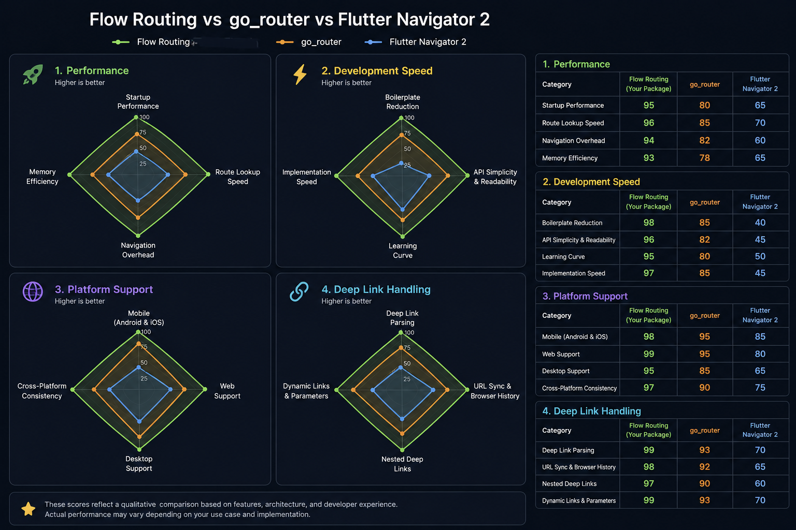

# Flow Routing

**The next-generation Flutter router** — typed, fast, and built from first principles.


Published on pub.dev as [`flow_routing`](https://pub.dev/packages/flow_routing).

[](CHANGELOG.md)
[](https://flutter.dev)

```dart
context.flow(Routes.home);
context.flow(Routes.user(id: 42));
context.flow(Routes.about, push: true);
context.pop();

Routes.user(id: 5).location; // → "/users/5"
```

## Why Flow?

| Feature | Flow | GoRouter | AutoRoute |
|---------|------|----------|-----------|
| Typed routes | ✅ First-class | ⚠️ Codegen | ✅ Codegen required |
| No code generation | ✅ | ✅ | ❌ |
| Separated nav stacks | ✅ | ❌ | ⚠️ |
| Pipeline guards | ✅ | ⚠️ | ✅ |
| Web-first URLs | ✅ | ⚠️ | ✅ |
| Optional middleware | ✅ | ❌ | ❌ |

## Features

- **Instance routes** — `Routes.user(id: 42)` not `'/users/42'`
- **Unified navigation** — `context.flow()` for go and push; `context.pop()` to go back
- **Reverse routing** — URLs generated automatically via `.location`
- **Pipeline guards** — composable auth, roles, async validation
- **Middleware** — logging, analytics, localization hooks
- **Separated stacks** — declarative `flow` vs overlay `flow(..., push: true)`
- **Web support** — clean URLs, browser history, refresh-safe parsing
- **Transitions** — material, fade, slide, none
- **Shell routes** — nested navigation and tab branches
- **Testing** — `FakeFlowRouter`, engine unit tests, widget tests
- **Migration** — helpers for GoRouter, Navigator, AutoRoute, Beamer

## Quick Start

```yaml
dependencies:
  flow_routing: ^2.0.0
```

```dart
import 'package:flow_routing/flow_routing.dart';

abstract final class Routes {
  static const home = FlowRoute(name: 'home', pathTemplate: '/');
}

final router = FlowRouter(
  routes: [
    flow('/', name: 'home', builder: (context, route) => const HomePage()),
  ],
);

void main() => runApp(FlowApp.router(router: router));
```

See [Getting Started](docs/GETTING_STARTED.md) for the full guide.

## Example App

A polished demo showcasing typed navigation, guards, middleware, and web URLs:

```bash
cd example
flutter run -d chrome   # Web
flutter run             # Mobile
```

## Documentation

| Guide | Description |
|-------|-------------|
| [Getting Started](docs/GETTING_STARTED.md) | Install and first routes |
| [API Reference](docs/API.md) | Complete public API |
| [Architecture](docs/ARCHITECTURE.md) | System design |
| [Cookbook](docs/COOKBOOK.md) | Recipes and patterns |
| [Migration](docs/MIGRATION.md) | From GoRouter, AutoRoute, etc. |
| [GoRouter Issues](docs/GOROUTER_ISSUES.md) | How Flow addresses 287+ issues |

## Project Structure

```
flow/
├── lib/           # Package source
├── example/       # Demo application
├── docs/          # Documentation
├── test/          # Unit & widget tests
└── benchmark/     # Performance benchmarks
```

## License

MIT — see [LICENSE](LICENSE).
